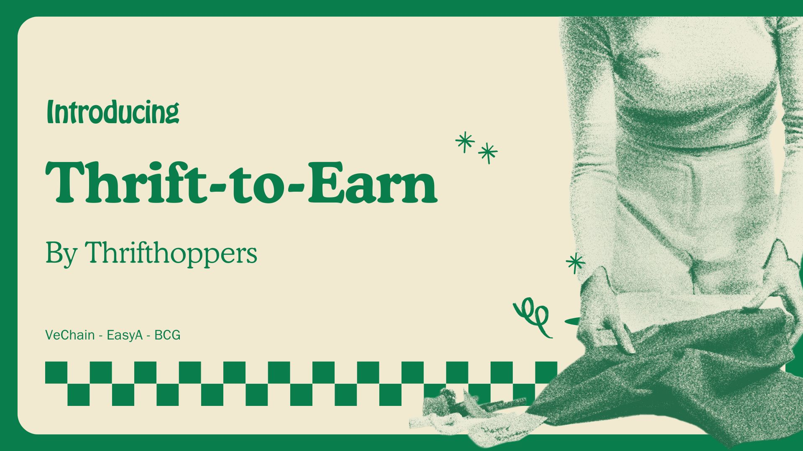

# BCG X EasyA Hackathon



Thrfit-to-Earn. 

Thriftr is a sustainable and rewarding platform for users to engage in sustainable fashion practices and earn B3TR tokens in return.

## Why?
Singapore generates around 168,000 tons of textile and leather waste annually —  Only 6% of textile waste is recycled. In recent years, thrifting and sustainable fashion has become trendy among youths in various countries. What if you could get rewards for doing what you love and have a positive impact at the same time?

Utilising VeBetterDao's B3TR tokens, we can create an ecosystem that rewards sustainable behaviour like thrifting. User's will be able to learn about new stores, get future benefits from obtaining tokens, and interact with more like minded-people. Our vision is to make sustainability easy and rewarding, one t-shirt at a time.

## Project Structure

- `frontend/`: React and Next.js frontend
- `backend/`: Express.js backend
- `contracts/`: Hardhat smart contracts on Vechain

## Setup

### Frontend
Navigate to the `frontend` directory, install dependencies, and start the development server:

```bash
cd frontend
npm install
npm run dev
```

### Backend
Navigate to the `backend` directory, install dependencies, and start the development server:

```bash
cd backend
npm install
node server.js
```

### Deployed Contracts (On testnet)
```bash
0xa4e6289bc5bffb30591e945072888c57ca5a0129 [Ecoearn contract]
0xbf64cf86894Ee0877C4e7d03936e35Ee8D8b864F [Rewards Token]
0x5F8f86B8D0Fa93cdaE20936d150175dF0205fB38 [X2EarnRewardsPool]
```
